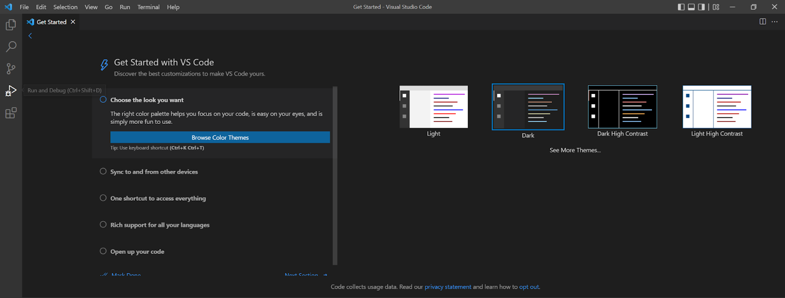

# Remote Access tutorial

In this tutorial, I will teach you how to access your course-specific account on ieng6, as well as a few other commands that could help simplify the process.

Let's get started.

## Step 1: Install Virtual Studio Code

First, you should have Visual Studio code installed on your computer. If you did not already have it installed, use [this link](code.visualstudio.com)  to download it. Complete the installation and open the program. You should be greeted with a screen like this:

Congratulations -- you have completed the first step!

## Step 2: Remotely Connecting

Now that we have Visual Studio Code up and running, we can use it to access a computer remotely. 

Start by opening a terminal on VS Code. The keyboard shortcut on Windows is Ctrl + ` (the key to the left of the 1). For Macbooks, use the Command key instead.

Then, log in to your course-specific account, with the following command:

> ssh cs15lfa22xx@ieng6.ucsd.edu (where xx is two letters unique to your account)

It will prompt you for your password, so input that as well. After successful login, you should be able to see something like this.

(Note that in the above image, I had to use my ucsd email to access it since my course-specific account had issues with accepting my password)

## Step 3: Trying some commands

Now that you're logged in, you can test some commands in the remote computer.

For example, I ran the "cd ~" command, which changes your current directory to the home directory but doesn't return anything. I also used the cat command on a file called "hello.txt" which printed the contents of the file. Finally, I used the ls command to list all the files in my directory.

## Step 4: Moving files with scp

Now we will be using the scp (secure copy) command to copy files from our computers to remote computers. 

To do so, create a file on your computer (can be any file) and type the following command:

> scp (filename) (cs15lfa22xx@ieng6.ucsd.edu:~/)

This will copy the file over to your account's home directory on the remote computer, but it will also prompt you to input your password to start the transfer.

(Note that in my example picture I am using my active directory email)

## Step 5: Create an SSH key