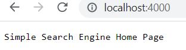
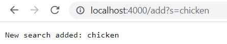
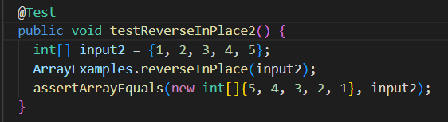
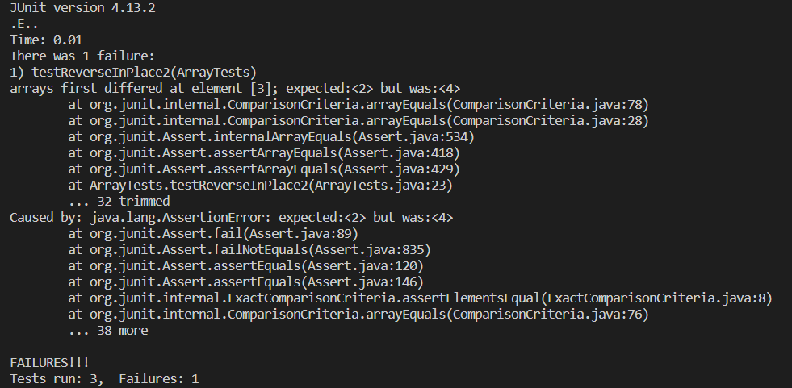
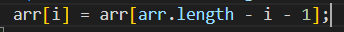
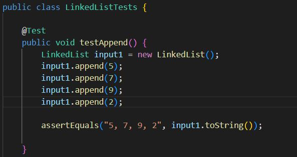
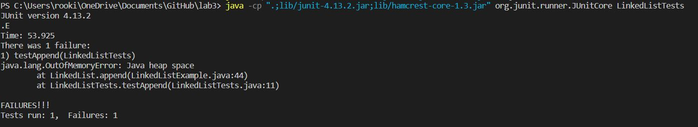

# Part 1

This is my code for the simple search engine. It is incomplete, unfortunately, and it cannot do much.

```
import java.io.IOException;
import java.net.URI;

class Handler implements URLHandler {

    String keyword;
    int n;
    int value;
    String[] wordlist;
    String newKeyword;

    public String handleRequest(URI url) {
        wordlist = new String[] {"football", "soccer", "basketball"};
        if (url.getPath().equals("/")) {
            return String.format("Simple Search Engine Home Page");

        } else if (url.getPath().equals("/" + wordlist[0])) {
            keyword = wordlist[0];
            return keyword;
        } else if (url.getPath().equals("/" + wordlist[1])) {
            keyword = wordlist[1];
            return keyword;
        } else if (url.getPath().equals("/" + wordlist[2])) {
            keyword = wordlist[2];
            return keyword;
        }
        } else if (url.getPath().equals("/testword")) {
            keyword = "test";
            return keyword;
        } 
        else {
                System.out.println("Path: " + url.getPath());
                if (url.getPath().contains("/add")) {
                    String[] parameters = url.getQuery().split("=");
                    if (parameters[n].equals("s")) {
                        newKeyword = String.format(parameters[n+1]); 
                        wordlist[value] = newKeyword;
                        value++;
                        return String.format("New search added: %s", parameters[n+1]); 
                    }
                    

                }
            }
                return "404 Not Found!";
        }
    }

class SimpleSearch {
    public static void main(String[] args) throws IOException {
        if(args.length == 0){
            System.out.println("Missing port number! Try any number between 1024 to 49151");
            return;
        }

        int port = Integer.parseInt(args[0]);

        Server.start(port, new Handler());
    }
}

```
Welcome screen:



Added search:




# Part 2

## Reverse In Place bug (Array Tests)

Failure-inducing input:



Symptom:



From this failure message, the array's elements did not change position starting at the latter half of the array. The element [3] was still 4, meaning its position was unaffected.

Bug:



Fixed code:


## Linked List Example bug

The linked list bug was found in the append() function. I'm not quite sure of which line of code seems to be causing the issue, but it results in an out of memory error.

Failure-inducing input:



Symptom:



