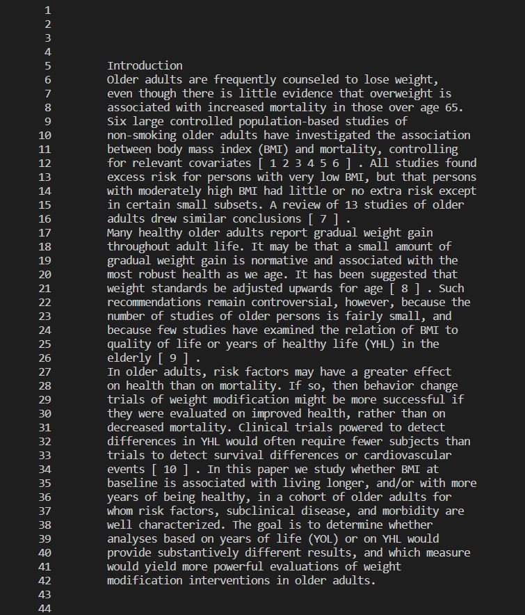
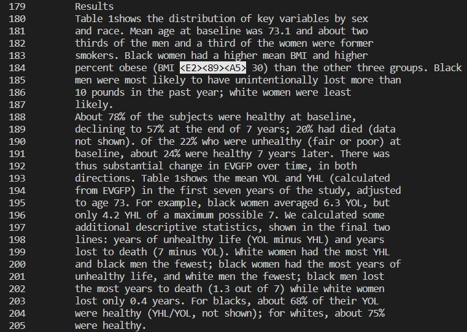
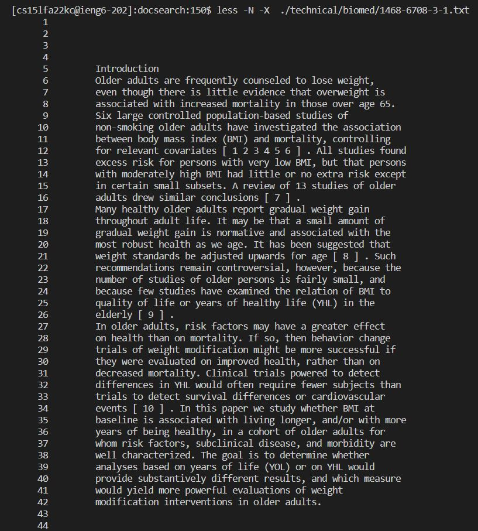
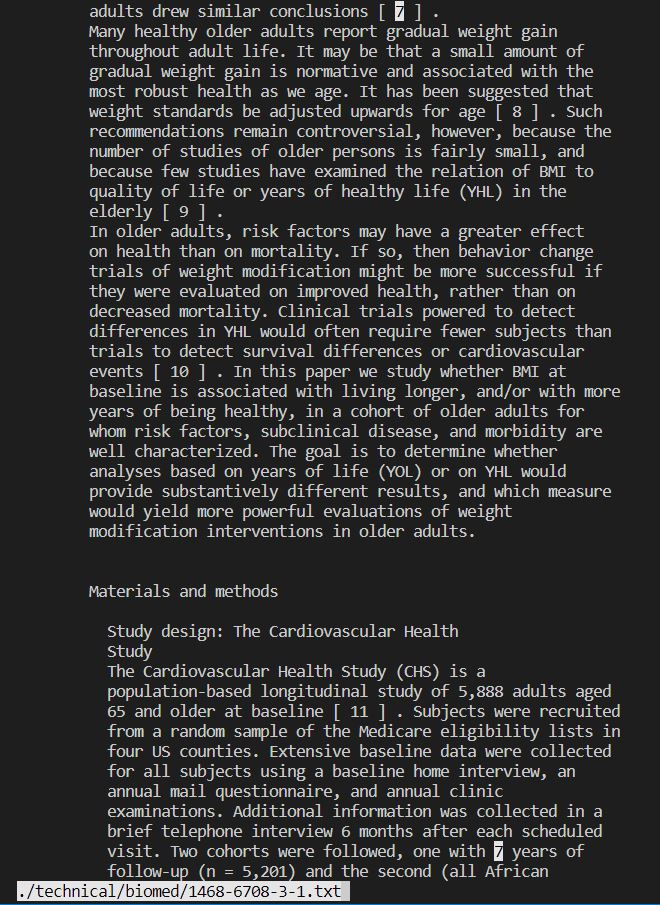
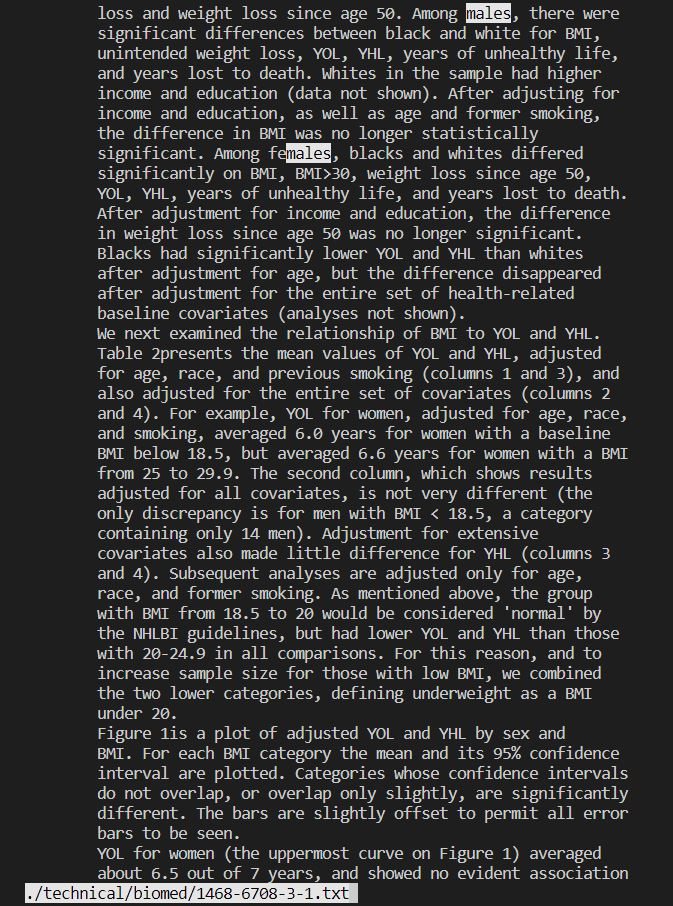
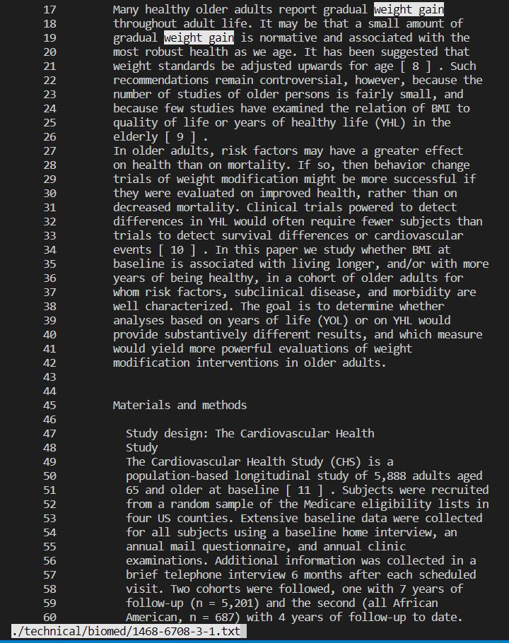

# Lab Report 4:  Alternate line options for the "less" command.

## Command 1: less -X


Input:
```
less -X <filename>
```
This command line option will leave some contents of your file in the terminal instead of clearing them by default. The contents left on the screen are determined by how many lines of the file you scrolled through before exiting. This option can be helpful if you don't want to reopen the file to see its contents. 

Example 1:


This output occurred after opening a file in a minimized terminal window and exiting without scrolling.

Example 2:


This output occurred after opening the same file in a larger terminal window and scrolling down multiple lines (pressing the down arrow key).

Example 3:


This output occurred after opening the same file and scrolling down multiple pages (by pressing the 'd' key) before quitting.


## Command 2: less -N

Input:
```
less -N <filename>
```
This command line option will show the line numbers in the file that you're running it with. This can be helpful if you need to reference a specific line in a file, and can be a useful tool in combination with other command lines.

Example 1:

This output was a result of running less -N on a file in the technical directory.

Example 2:

This output is similar to the last example, except in this case, the file was scrolled all the way down to lines 179 to 205. Notice that in these cases, the less function is still running (we have not terminated it using q).

Example 3:

In this example, the command combines the less -N command and the less -X command, so now the contents of the file are saved in the terminal along with the file's line numbers. Now, the user can see the part of the file and its line numbers without having to re-open and/or re-run commands.

# Command 3: less -p

Input:
```
less -p [pattern] <filename>
```

This command option causes the less command to start where the pattern is first found in the file. This can be useful for searching specific terms in text files, and may also be used in conjunction with other command options.

Example 1:

This output resulted from the input:
```
less -p 7 ./technical/biomed/1468-6708-3-1.txt
```
And as you can see, the command found the first instance of '7' in the text file.

Example 2:

This output resulted from the input:
```
less -p males ./technical/biomed/1468-6708-3-1.txt
```
The command also works with words and phrases in files.

Example 3:

This output resulted from the input:
```
less -p 'weight gain' -N ./technical/biomed/1468-6708-3-1.txt
Using this command option in combination with the -N option from before, we now know that the first instance of the phrase "weight gain" in this file appears on line 17.