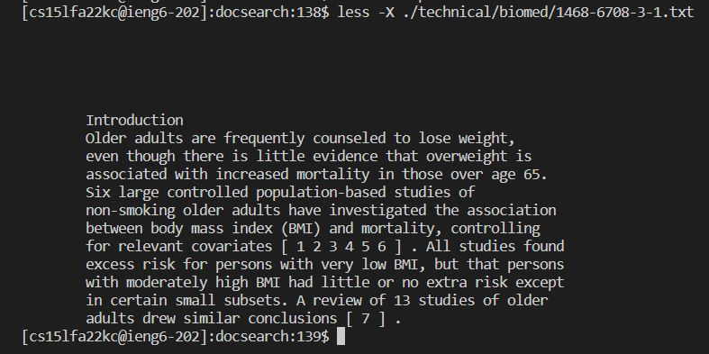
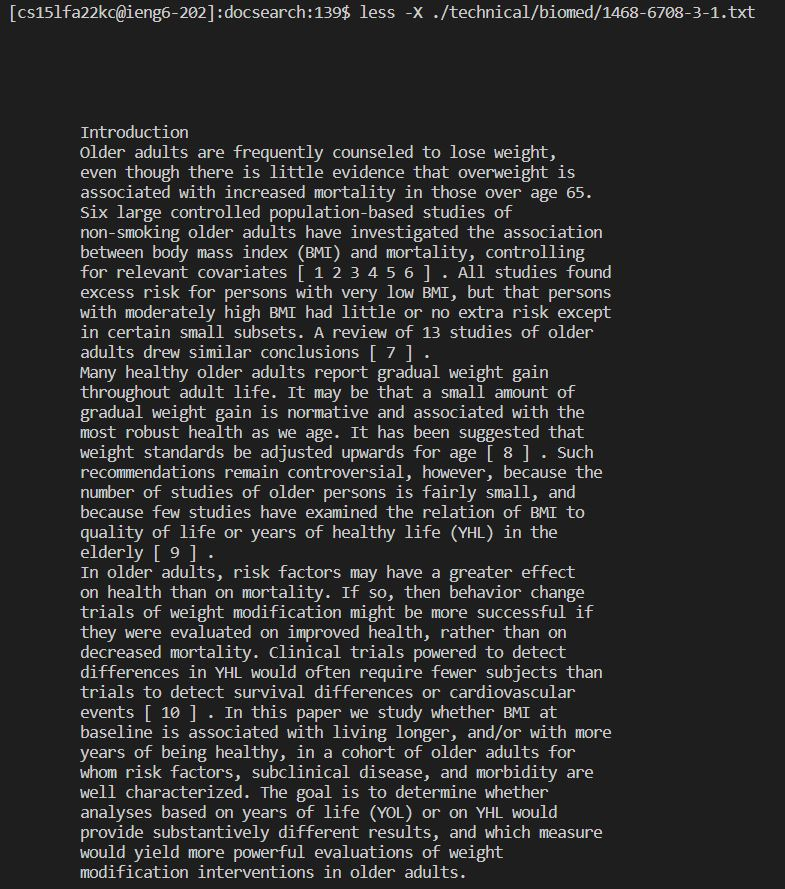
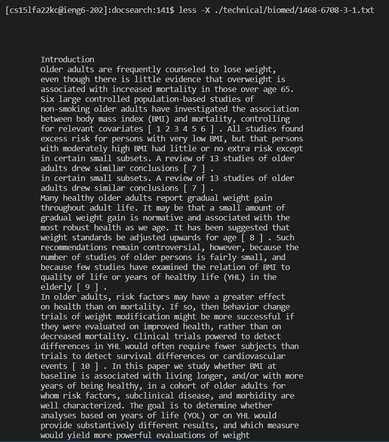

# Lab Report 4:  Alternate line options for the "less" command.

## Command 1: less -X


Input:
```
less -X <filename>
```
This command line option will leave some contents of your file in the terminal instead of clearing them by default. The contents left on the screen are determined by how many lines of the file you scrolled through before exiting. This option can be helpful if you don't want to reopen the file to see its contents. 

Example 1:



This output occurred after opening a file in a minimized terminal window and exiting without scrolling.

Example 2:



This output occurred after opening the same file in a larger terminal window and scrolling down multiple lines (pressing the down arrow key).

Example 3:



This output occurred after opening the same file and scrolling down multiple pages (by pressing the 'd' key) before quitting.


# Command 2: less -N

Input:
```
less -N <filename>
```
