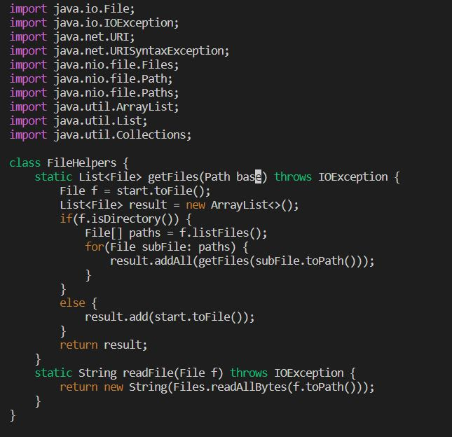
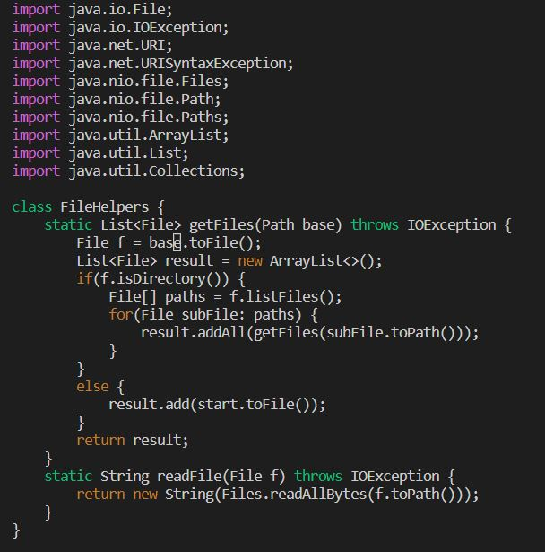
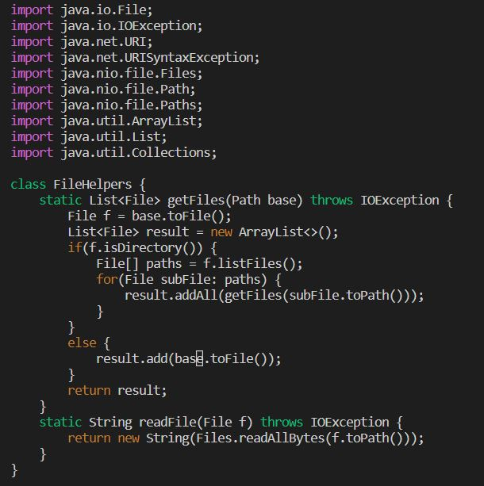
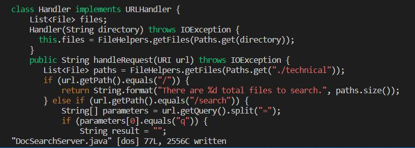

# Part 1

The task that I chose was changing the 'start' parameter and its uses to 'base' in DocSearchServer.java.

My process for doing so (after opening the file in Vim) went as follows:

```
/start<Enter>cgnbase
```
\
(13 keys pressed)\
I used the '/' key to search for the first instance of "start" in the file, then used cgn to delete "start" and input "base" in its place.
```
n<period key>
```
\
(2 keys pressed)\
N key to run /start again (searches for the next instance of start), period key to repeat deleting start and inputting base.
```
n<period key>
```
\
(2 keys pressed)\
Pressed the same two keys to delete the last instance of "start" parameter.\
(Note that the final instance of start in the file is a method and has no relation to the parameter.)
```
:w<Enter>
```
\
(3 keys pressed)\
Saved the file.

In total, this method used 20 key presses.

# Part 2

Using VS Code and copying into remote took: 2 minute 15 seconds
Using Vim took: ~1 minute

Setbacks: remembering to type out the whole scp command directly into the location to replace the file.

### Q: Which of these two styles would you prefer using if you had to work on a program that you were running remotely, and why?

A: I would prefer using Vim over editing directly in Visual Studio Code and copying into remote. Though these editing exercises don't seem super complicated and that the timing difference is minimal between them, I feel that for larger-scale projects, using Vim commands would be much faster than combing through numerous lines of code.

### Q: What about the project or task might factor into your decision one way or another? (If nothing would affect your decision, say so and why!)

A: The length of the project or task; as well as installing packages, libraries or applications that may already exist in the remote server and not my local computer (or vice versa!), would definitely impact my decision in using Visual Studio Code or Vim.