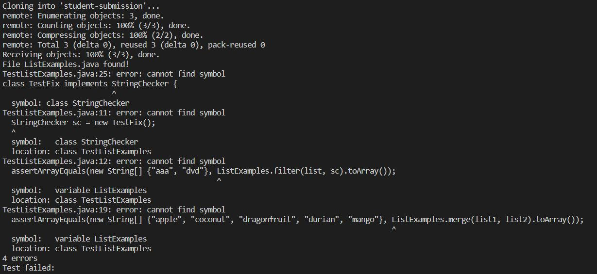

# Lab Report 5


This is my code for the grading script from Week 7.
Unfortunately, it is incomplete. For some reason, my TestListExamples file would not cooperate with the script.
These issues ranged from not recognizing ListExamples function calls to refusing to compile and exiting early in the script.
Therefore, some parts aren't working as intended, and I am still trying to diagnose the issue.

```
rm -rf student-submission
git clone $1 student-submission

cp TestListExamples.java student-submission
cp lib/hamcrest-core-1.3.jar student-submission
cp lib/junit-4.13.2.jar student-submission
cd student-submission
CPATH="hamcrest-core-1.3.jar:junit-4.13.2.jar"

if [[ -f "ListExamples.java" ]]
        then
                echo "File ListExamples.java found!"

        else
                echo "File not found, please recheck your submission. Score: 0."
                exit
fi


javac -cp $CPATH *.java

if [[ $? -eq 0 ]]
then
        javac -cp $CPATH TestListExamples.java 1> stdout.txt

else
        echo "File ListExamples.java does not compile! Please recheck your submission. Score: 0."        
fi

java -cp $CPATH org.junit.runner.JUnitCore TestListExamples 1> stdout.txt

if [[ $? -eq 0 ]]
then
        echo "All tests passed! Score: 100%."
else
        echo "Test failed: "
fi
```
Example 1: Using https://github.com/ucsd-cse15l-f22/list-methods-corrected



This was initially supposed to find the file and return a message stating that the file was found, compile the existing file, return the message, then run TestListExamples with no issue and receive a score of 100%. Since my TestListExamples.java file does not work, however, it will still return a test failed message (still resolving)

Example 2: Using https://github.com/ucsd-cse15l-f22/list-methods-compile-error


This case found the file and returned a message confirming it, then attempted to compile the file at the second if-else statement and failed to compile it, resulting in the return message.

Example 3: Using https://github.com/ucsd-cse15l-f22/list-methods-filename


Running the script with this repository causes it to prematurely exit after it cannot discover a file matching the name ListExamples.java. In this case, it's the else case of the first if-else statement.